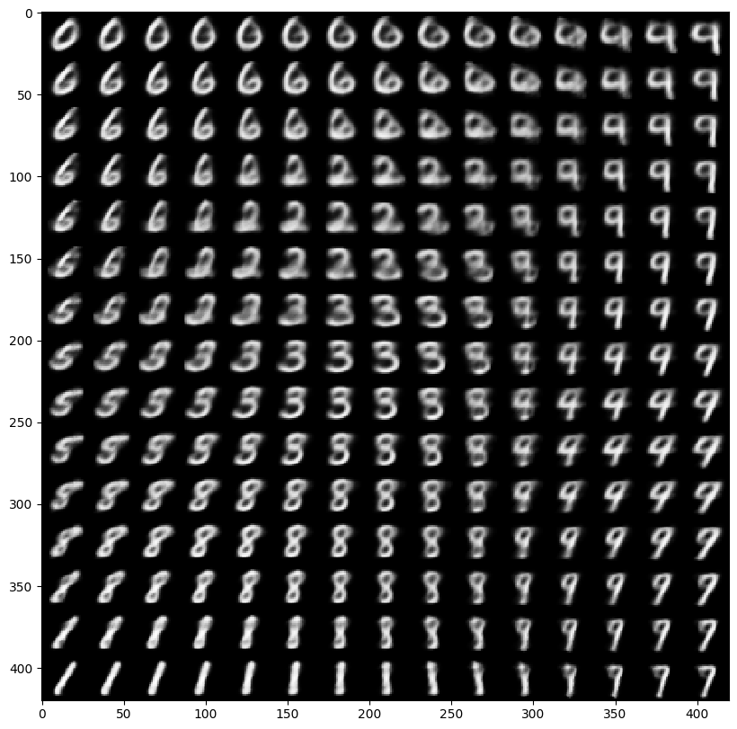
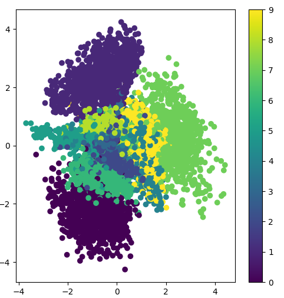

# Variational Autoencoders: Tutorial and Examples
This tutorial and examples are modified from [Bojone](https://github.com/bojone/vae) and [Keras Official API](https://github.com/keras-team/keras/blob/master/examples/variational_autoencoder.py). 
## Variational Autoencoders (VAE), MNIST Classification
### Environment
- Tensorflow 1.12
- Keras 2.2.4
- Python 3.6 (Anoconda)
- Pytorch 1.01

The source code can refer to [vae_keras.py](https://github.com/WilliamYi96/VAE/blob/master/vae_keras.py) and [vae_pytorch.py](https://github.com/WilliamYi96/VAE/blob/master/vae_pytorch.py) respectively.

Firstly, the result of VAE implemented by keras is (hyper-parameters could refer to the source-code.):

<!--  -->
         

As we can see from the above picture, the image quality generated by VAE is very blur while GANs can do better than it in some way. By the way, we can also get the cluster of 10 digits:  

 

